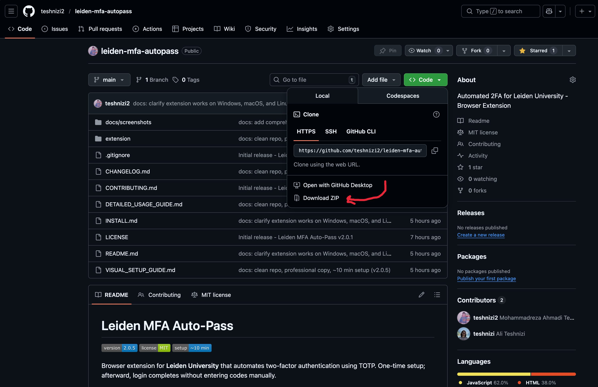
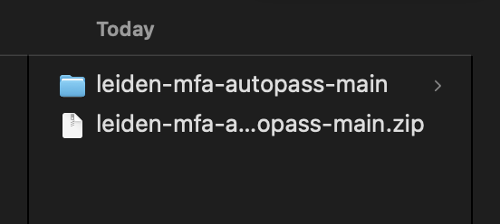
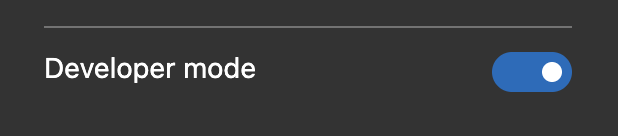
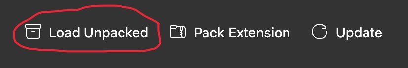
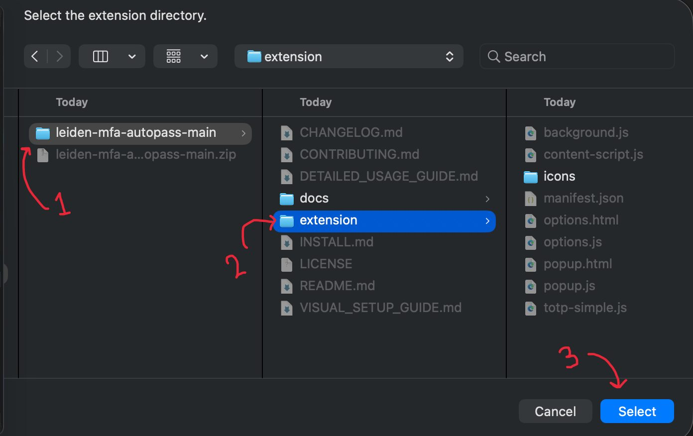
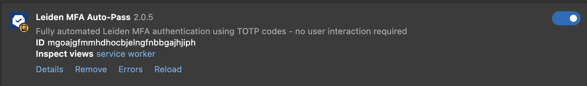
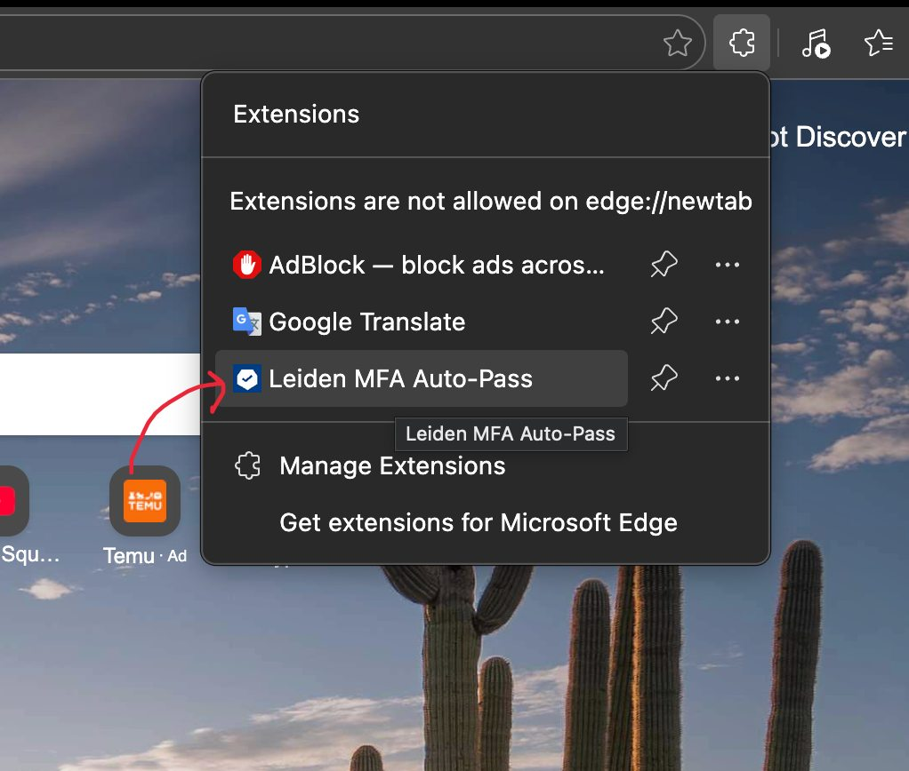
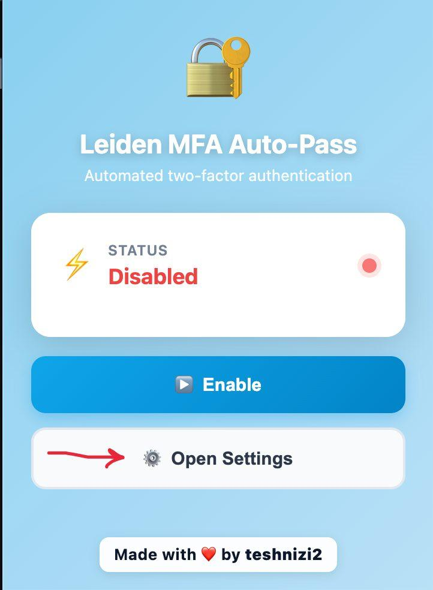
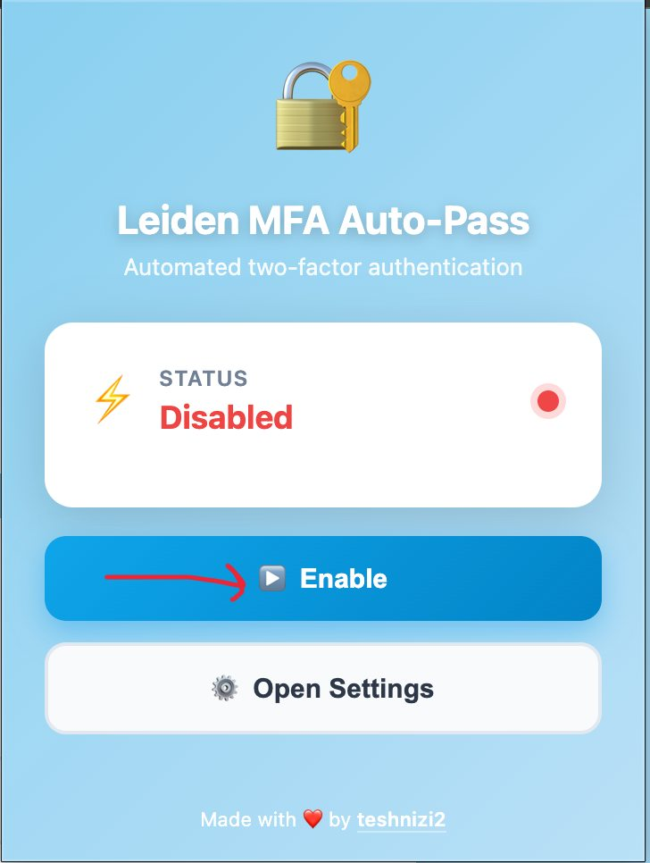

# Leiden MFA Auto-Pass

Automate Leiden University’s two-factor login. One-time setup (**~15 minutes**), then the extension fills and submits the code for you—no more copying codes from your phone.

| | |
|:--|:--|
| **Browsers** | Edge, Chrome, Brave, Opera (Chromium-based) |
| **Platforms** | Windows, macOS, Linux |
| **Repository** | [github.com/teshnizi2/leiden-mfa-autopass](https://github.com/teshnizi2/leiden-mfa-autopass) |

---

## Full setup guide

Follow these steps once. After that, visiting a Leiden login page will complete 2FA automatically.

| # | Step |
|---|------|
| 1 | [Download](#step-1--download) |
| 2 | [Install the extension](#step-2--install-the-extension) |
| 3 | [Open extension settings](#step-3--open-extension-settings) |
| 4 | [Get your secret key from Leiden](#step-4--get-your-secret-key-from-leiden) |
| 5 | [Configure the extension](#step-5--configure-the-extension) |
| 6 | [Enable the extension](#step-6--enable-the-extension) |
| 7 | [You’re done](#step-7--youre-done) |

---

### Step 1 — Download

1. On this page, click the green **Code** button, then **Download ZIP**.

   

2. Unzip the file on your computer:
   - **Mac:** Double-click the ZIP file.
   - **Windows:** Right-click the ZIP file → **Extract all** (or “Unzip”).

   

---

### Step 2 — Install the extension

1. Open **Manage extensions** in your browser (extensions icon in the toolbar, or your browser’s extensions page).

   

2. Turn **Developer mode** on (toggle at the bottom of the page).

   

3. Click **Load unpacked**.

   

4. In the folder you downloaded and unzipped, open the **`extension`** folder (the one that contains `manifest.json`), then click **Select** (or **Select Folder**).

   

5. **Leiden MFA Auto-Pass** should now appear in your extensions list.

   

---

### Step 3 — Open extension settings

1. In the extensions menu or list, find **Leiden MFA Auto-Pass**.
2. Click it, then click **Open Settings** (or **Extension options** from the extensions management page).

   

   

---

### Step 4 — Get your secret key from Leiden

1. Open **[Leiden Identity Manager](https://account.services.universiteitleiden.nl/idmdash/#/landing)** and sign in.

2. Open the **Multi-Factor Authentication** section.

   

3. Find **TOTP Non-NetIQ Authenticator** and click **Enroll** (first time) or **Modify** (if you already use it).

   

4. On the next page, **copy the secret key** (the long string of letters and numbers). Keep this tab open for Step 5.

   

---

### Step 5 — Configure the extension

1. In the extension **Settings** page, paste your secret key into **TOTP Secret Key**.

   

2. A **6-digit code** will appear below and update every 30 seconds.

   

3. If Leiden is still asking for a code to finish enrollment: switch to the Leiden tab, enter the 6-digit code from the extension, and click **Next**.

4. Back in the extension, click **Save Settings**.

5. *(Optional)* To auto-fill your Leiden username and password on the login page, enable **Auto-fill credentials**, enter them, and save again.

---

### Step 6 — Enable the extension

The extension is **Disabled** by default. Before you test, turn it on:

1. Click the **Leiden MFA Auto-Pass** icon in the toolbar (or open the extensions menu).
2. Click **Enable**.

   

---

### Step 7 — You’re done

1. Go to any Leiden login page (e.g. [login.leidenuniv.nl](https://login.leidenuniv.nl/)).

2. Sign in with your username and password (or let the extension fill them if you turned that on).

3. The extension will choose “Code from non-NetIQ Authenticator”, generate the code, fill it in, and submit. You should be logged in without typing a code.

> **Note:** The extension runs once per browser session on the code step to avoid lockouts. To run it again in the same session, close all browser windows and open a new one.

---

## Summary

| Step | What you do | Time |
|:----:|-------------|:----:|
| 1 | Download ZIP and unzip (Mac: double-click / Windows: right-click → Extract) | ~2 min |
| 2 | Manage extensions → Developer mode → Load unpacked → Select `extension` folder | ~3 min |
| 3 | Choose Leiden MFA Auto-Pass → Open Settings | ~1 min |
| 4 | Get secret key from Leiden Identity Manager | ~4 min |
| 5 | Paste secret in extension, save, complete enrollment if needed | ~3 min |
| 6 | Enable the extension | — |
| 7 | Log in to a Leiden site — extension does the rest | ~2 min |

**Total: about 15 minutes.**

---

## Author

**teshnizi2** — sole contributor and maintainer  
[https://github.com/teshnizi2/leiden-mfa-autopass](https://github.com/teshnizi2/leiden-mfa-autopass)

---

## License

MIT. Not affiliated with Leiden University. Use at your own risk; keep a backup 2FA method (e.g. your phone app).  
Inspired by [AutoULCN](https://github.com/kooroshkz/AutoULCN).
