

  
  
  

<h1 align="center">Leiden MFA Auto-Pass</h1>

  <strong>Automate Leiden University two-factor login.</strong> 
  One-time setup, then the extension fills and submits the TOTP code for you—no more copying from your phone.

  <a href="#full-setup-guide">Setup guide</a> •
  <a href="#step-1--download">Download</a> •
  <a href="#author">Author</a>

  Works with Edge, Chrome, Brave, Opera • Windows, macOS, Linux

---

## ✨ At a glance

| Property | Details |
|:---------|:--------|
| **Browsers** | Edge, Chrome, Brave, Opera (Chromium-based) |
| **Platforms** | Windows, macOS, Linux |
| **Method** | TOTP (Authenticator code only) |
| **Repository** | [github.com/teshnizi2/leiden-mfa-autopass](https://github.com/teshnizi2/leiden-mfa-autopass) |

---

## 📋 Full setup guide (~15 min)

> **Do this once.** After that, visiting a Leiden login page will complete 2FA automatically.

| # | Step |
|:--:|:-----|
| 1 | [Download](#step-1--download) |
| 2 | [Install the extension](#step-2--install-the-extension) |
| 3 | [Get your secret key from Leiden](#step-3--get-your-secret-key-from-leiden) |
| 4 | [Open extension settings](#step-4--open-extension-settings) |
| 5 | [Configure the extension](#step-5--configure-the-extension) |
| 6 | [Complete Leiden enrollment](#step-6--complete-leiden-enrollment) |
| 7 | [Enable the extension](#step-7--enable-the-extension) |
| 8 | [Done](#step-8--youre-done) |

---

### Step 1 — Download

1. On this repository page, click **Code** → **Download ZIP**.

   

     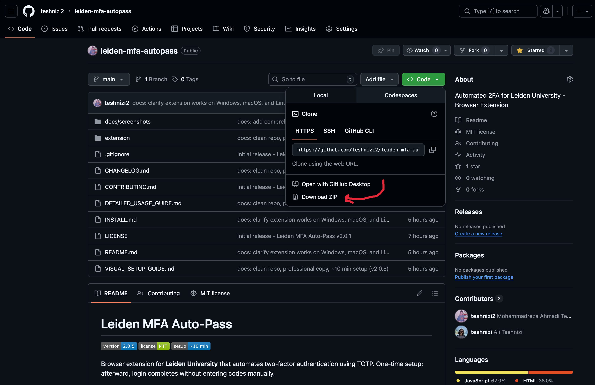
   

2. Unzip the file:
   - **macOS:** Double-click the ZIP file.
   - **Windows:** Right-click → **Extract all** (or use an unzip tool).

   

     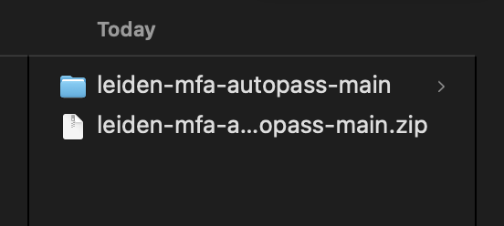
   

---

### Step 2 — Install the extension

1. Open **Manage extensions** (toolbar icon or your browser's extensions page).

   

     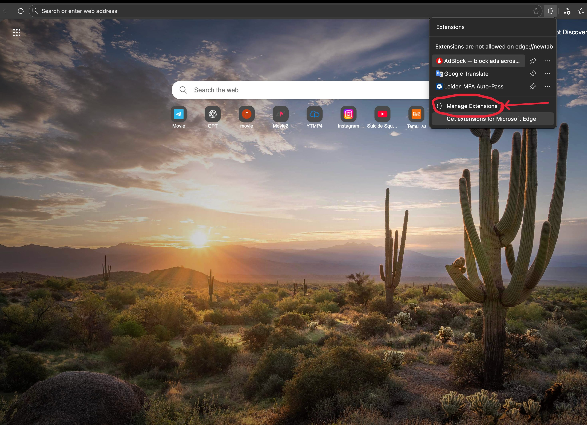
   

2. Turn **Developer mode** on (toggle at the bottom).

   

     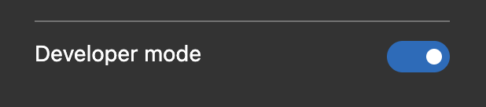
   

3. Click **Load unpacked**.

   

     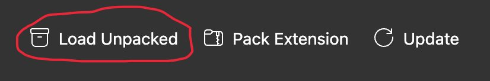
   

4. Select the **`extension`** folder (the one containing `manifest.json`) and confirm.

   

     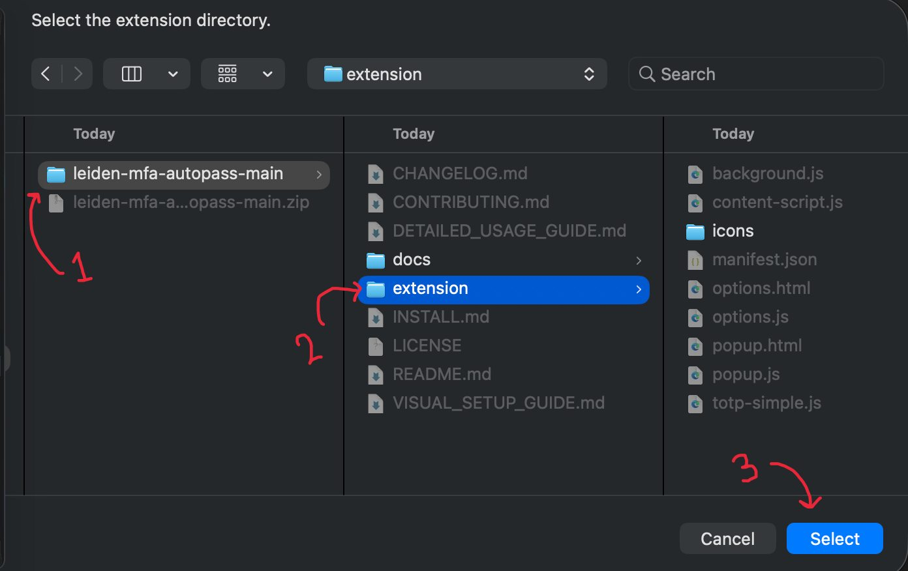
   

5. **Leiden MFA Auto-Pass** should appear in your extensions list.

   

     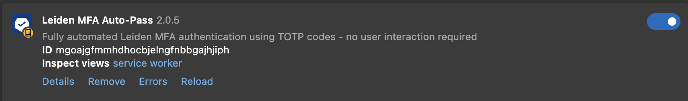
   

6. Find **Leiden MFA Auto-Pass** in the extensions menu or list.

   

     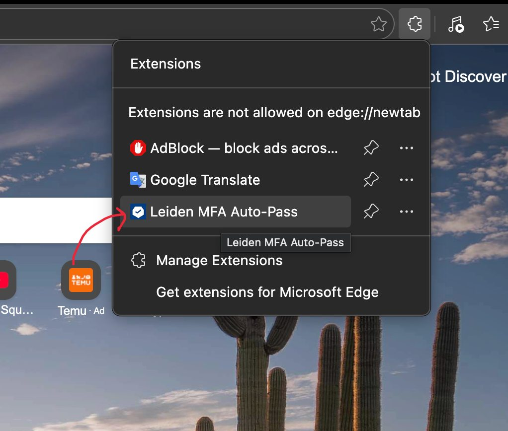
   

7. Click it, then click **Open Settings** (or **Extension options** from the management page).

   

     
   

8. Find the **TOTP configuration** section.

   

     
   

---

### Step 3 — Get your secret key from Leiden

1. Open **[Leiden Identity Manager](https://account.services.universiteitleiden.nl/idmdash/#/landing)** and sign in.

2. Go to **Multi-Factor Authentication**.

   

     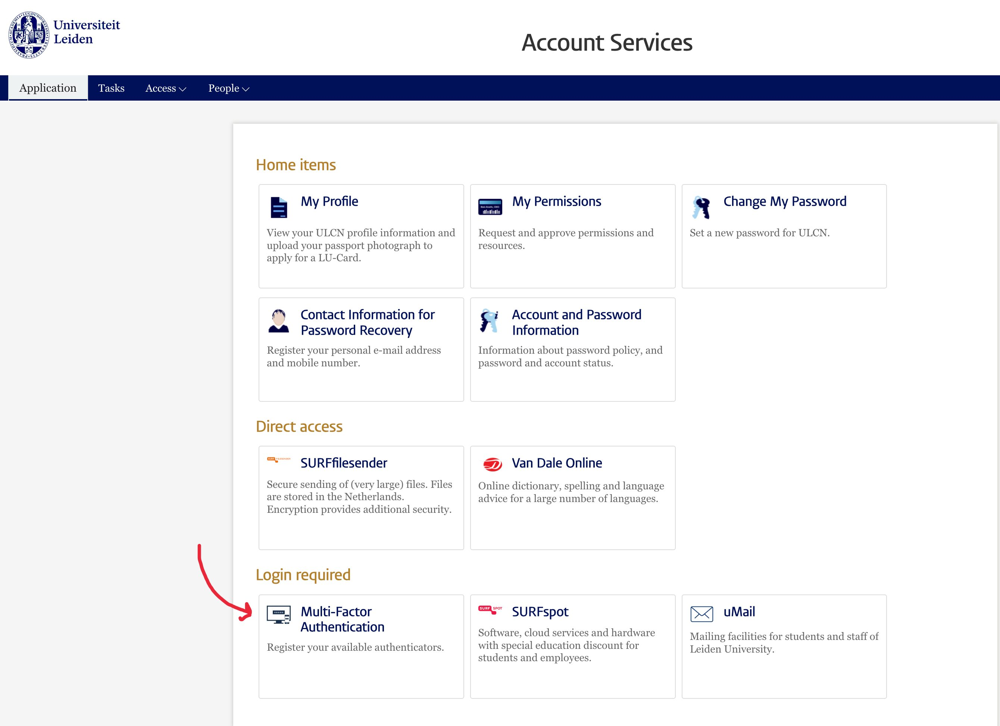
   

3. Complete the two-step verification using any method available to you:

   

     
   

4. Under **TOTP Non-NetIQ Authenticator**, click **Enroll** (first time) or **Modify** (if already set up).

   

     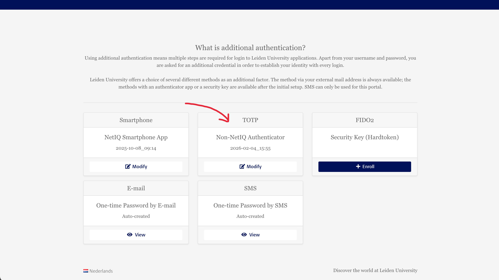
   

5. **Copy the secret key** (long alphanumeric string), then paste it into the TOTP configuration in the extension settings and click **Next**.

   

     
   

6. Paste the code that appears in the TOTP section and click **Next**:

   

     
   

7. At the end of the extension settings page, **save the changes**:

   

     
   

---

### Step 4 — Open extension settings

> **Note:** If you already opened the settings in Step 2, you can skip this step.

If you need to access the extension settings:

1. Find **Leiden MFA Auto-Pass** in the extensions menu or list.
2. Click it, then click **Open Settings** (or **Extension options** from the management page).
3. Navigate to the **TOTP configuration** section.

---

### Step 5 — Configure the extension

> **Note:** If you already configured the extension in Step 3, you can skip to Step 6.

To configure the extension with your secret key:

1. In the extension settings TOTP configuration section, paste your secret key (copied from Step 3) into the **TOTP Secret Key** field.
2. Click **Next** to verify the configuration.
3. Confirm that a 6-digit code appears and refreshes every 30 seconds.
4. Click **Save Settings** at the bottom of the page to save your changes.

---

### Step 6 — Complete Leiden enrollment

1. Go back to the **Leiden Identity Manager** tab (from Step 3).

2. Enter the **6-digit code** from the extension (displayed in the TOTP configuration section) into the verification field.

3. Click **Next** (or **Verify**) to complete enrollment.

4. Leiden enrollment is now complete. You can close this tab.

---

### Step 7 — Enable the extension

The extension is **disabled** by default. Before testing:

1. Click the **Leiden MFA Auto-Pass** icon (or open the extensions menu).
2. Click **Enable**.

   

     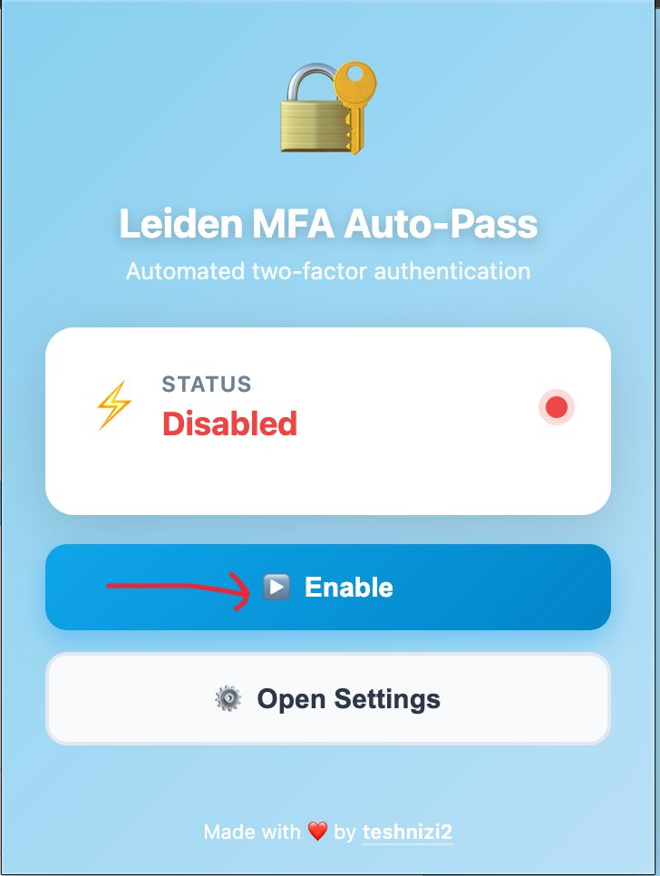
   

---

### Step 8 — You're done 🎉

1. Go to a Leiden login page (e.g., [login.leidenuniv.nl](https://login.leidenuniv.nl/)).

2. Sign in with your username and password (or let the extension fill them if you enabled that feature).

3. The extension will automatically select "Code from non-NetIQ Authenticator", enter the code, and submit it. You should be logged in without typing a code manually.

---

## 👤 Author

**teshnizi2**  
[https://github.com/teshnizi2/leiden-mfa-autopass](https://github.com/teshnizi2/leiden-mfa-autopass)

---

## 📄 License

MIT. Not affiliated with Leiden University. Use at your own risk; keep a backup 2FA method (e.g., your phone app).
