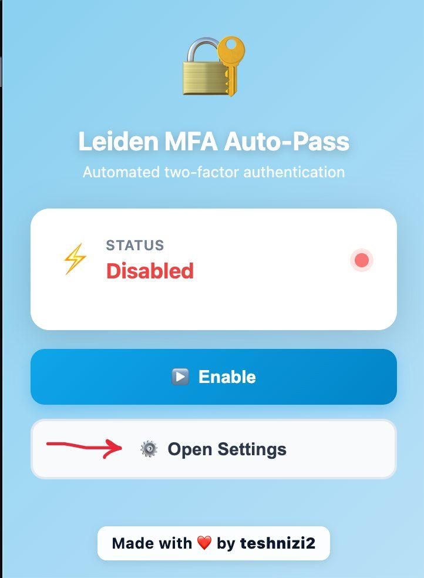
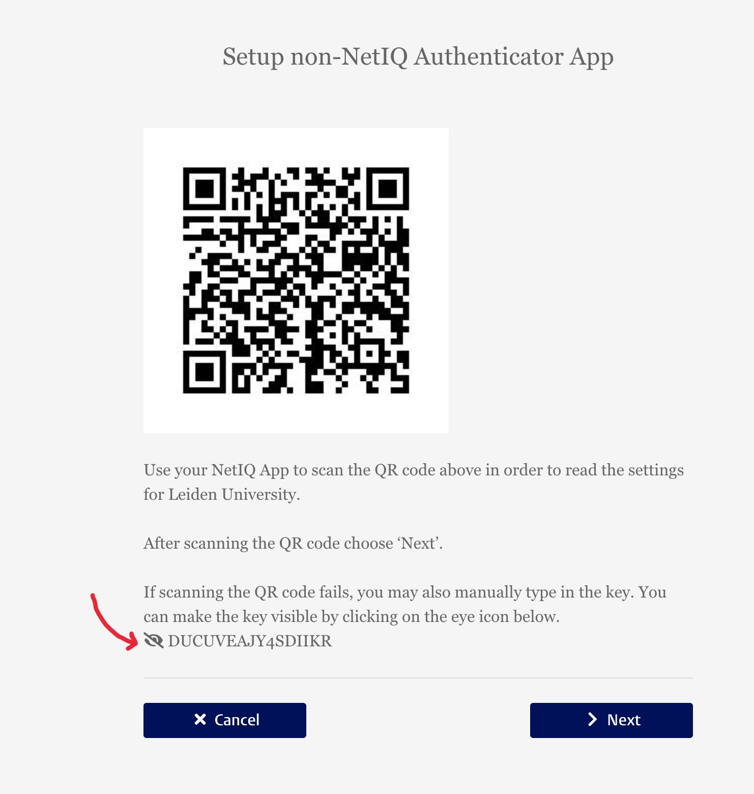
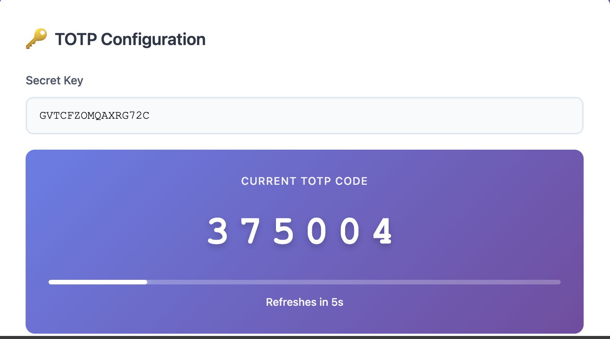
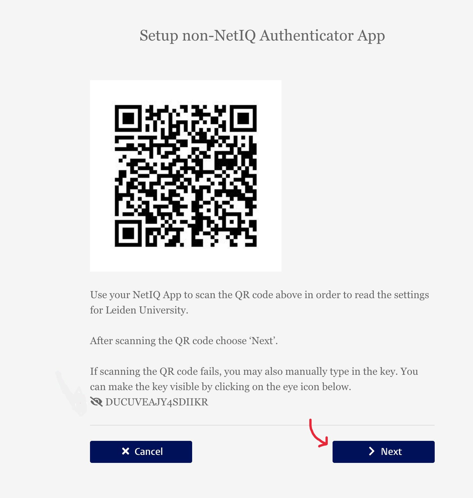

  
  
  

<h1 align="center">Leiden MFA Auto-Pass</h1>

  <strong>Automate Leiden University two-factor login.</strong> 
  One-time setup, then the extension fills and submits your TOTP code automatically.

  <a href="#full-setup-guide-15-min">Setup guide</a> •
  <a href="#step-1--download">Download</a> •
  <a href="#author">Author</a>

  Works with Edge, Chrome, Brave, and Opera (Chromium-based) on Windows, macOS, and Linux.

---

## At a glance

| Property | Details |
|:---------|:--------|
| Browsers | Edge, Chrome, Brave, Opera (Chromium-based) |
| Platforms | Windows, macOS, Linux |
| Method | TOTP (non-NetIQ Authenticator code) |
| Repository | [github.com/teshnizi2/leiden-mfa-autopass](https://github.com/teshnizi2/leiden-mfa-autopass) |

---

## Full setup guide (~15 min)

Do this once. After setup, the extension handles the TOTP step automatically when you log in to Leiden services.

| # | Step |
|:--:|:-----|
| 1 | [Download](#step-1--download) |
| 2 | [Install the extension and open settings](#step-2--install-the-extension-and-open-settings) |
| 3 | [Get your secret key from Leiden](#step-3--get-your-secret-key-from-leiden) |
| 4 | [Configure the extension](#step-4--configure-the-extension) |
| 5 | [Complete Leiden enrollment](#step-5--complete-leiden-enrollment) |
| 6 | [Enable the extension](#step-6--enable-the-extension) |
| 7 | [Done](#step-7--done) |

---

### Step 1 — Download

1. On this repository page, click **Code** -> **Download ZIP**.

   

2. Unzip the file:
   - **macOS:** Double-click the ZIP file.
   - **Windows:** Right-click -> **Extract all**.

   

---

### Step 2 — Install the extension and open settings

1. Open your browser's extensions page (**Manage extensions**).

   

2. Enable **Developer mode**.

   

3. Click **Load unpacked** and select the `extension` folder (the one that contains `manifest.json`).

   

   

4. Confirm that **Leiden MFA Auto-Pass** appears in the extensions list.

   

5. Open the extension's settings (or **Extension options**).

   

   

---

### Step 3 — Get your secret key from Leiden

1. Open the **[Leiden Identity Manager](https://account.services.universiteitleiden.nl/idmdash/#/landing)** and sign in.

2. Go to **Multi-Factor Authentication**.

   

3. Under **TOTP Non-NetIQ Authenticator**, click **Enroll** (first time) or **Modify** (already configured).

   

4. Copy the **secret key** (long alphanumeric string), then keep this tab open.

   

---

### Step 4 — Configure the extension

1. In extension settings, paste the secret key into **TOTP Secret Key**.

   

2. A 6-digit code will appear and refresh every 30 seconds. Copy the current code.

   

3. Click **Save Settings**.

4. Optional: Enable **Auto-fill credentials**, enter your Leiden username and password, and save again.

---

### Step 5 — Complete Leiden enrollment

1. Return to the Leiden tab from Step 3.

2. Enter the 6-digit code from Step 4 in the verification field.

3. Click **Next** (or **Verify**) to finish enrollment.

---

### Step 6 — Enable the extension

The extension is disabled by default.

1. Click the **Leiden MFA Auto-Pass** icon (or open the extensions menu).
2. Click **Enable**.

   

---

### Step 7 — Done

1. Go to a Leiden login page (for example, [login.leidenuniv.nl](https://login.leidenuniv.nl/)).
2. Sign in with your username and password (or let the extension auto-fill them).
3. The extension selects **Code from non-NetIQ Authenticator**, enters the TOTP code, and submits it automatically.

---

## Author

**teshnizi2**  
[https://github.com/teshnizi2/leiden-mfa-autopass](https://github.com/teshnizi2/leiden-mfa-autopass)

---

## License

MIT. Not affiliated with Leiden University. Use at your own risk, and always keep a backup 2FA method (for example, your phone authenticator app).
