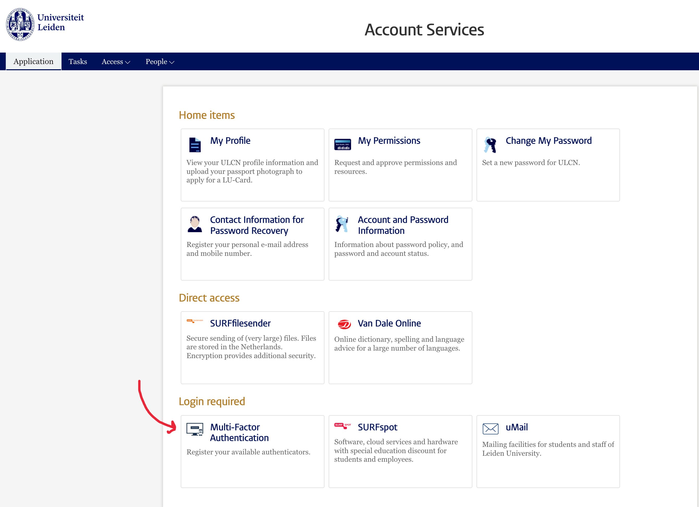
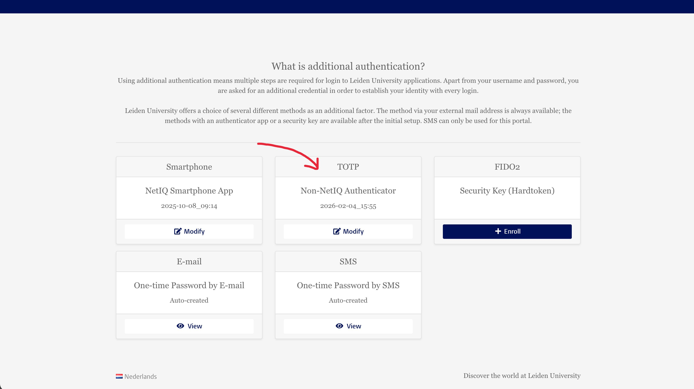
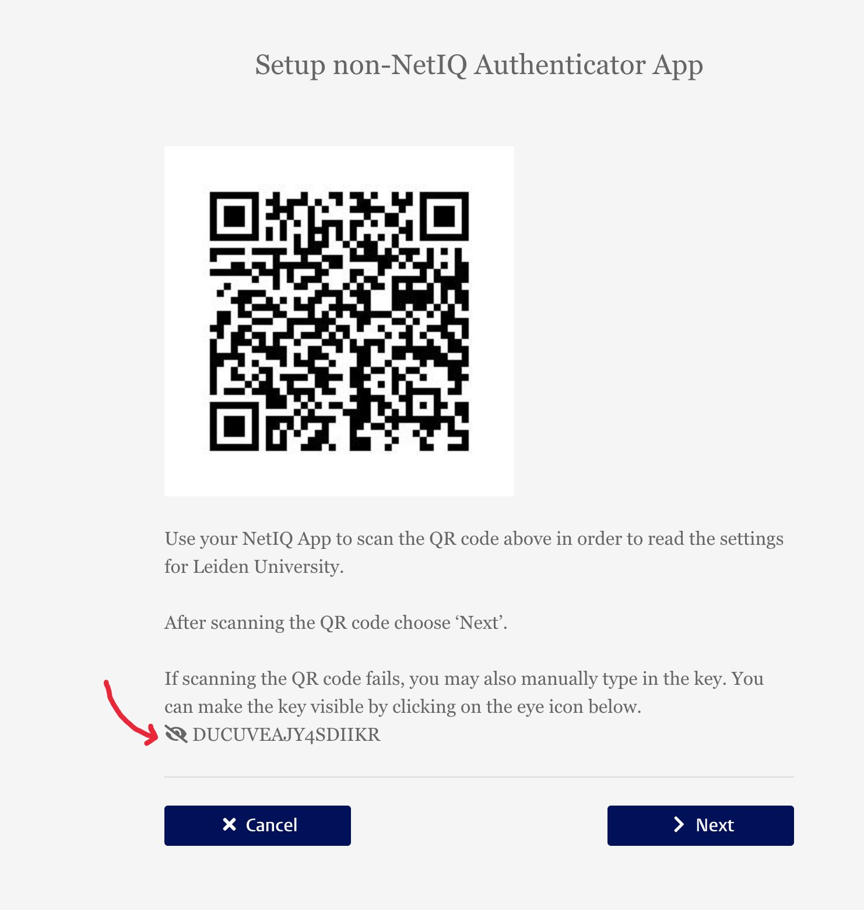
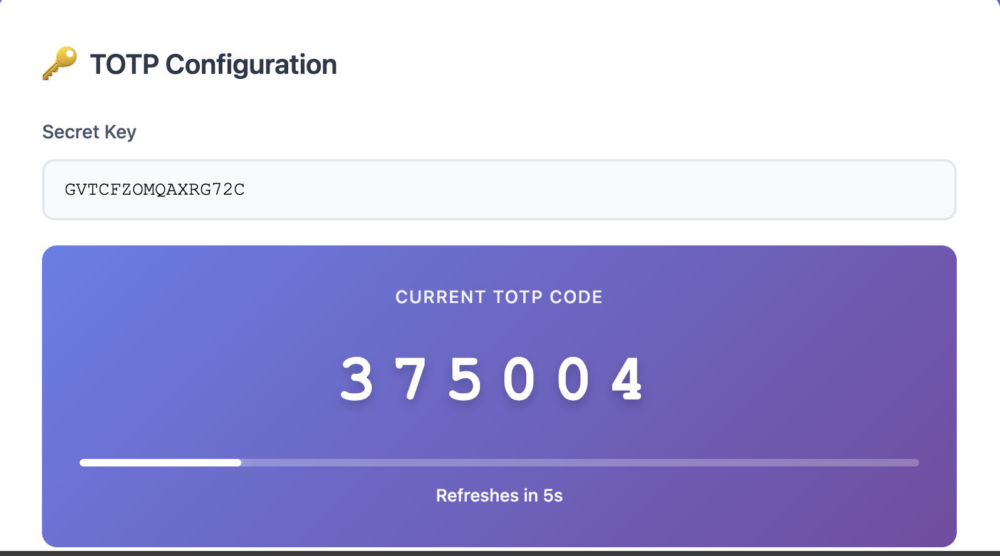
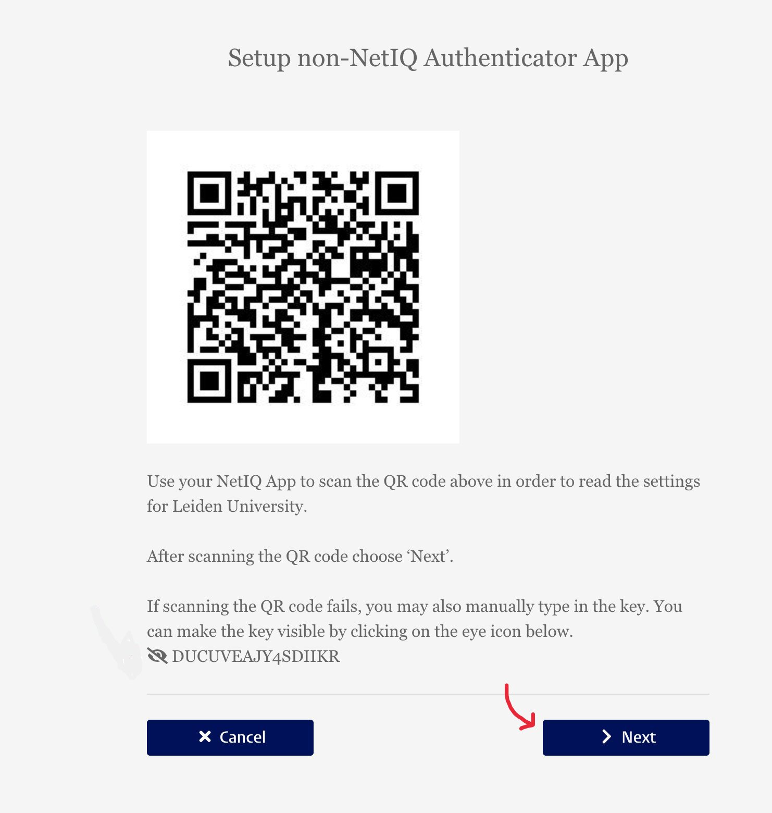

# 📸 Visual Setup Guide - Complete Walkthrough

This guide shows you **exactly** how to get your TOTP secret key from Leiden University and configure the extension.

---

## 📋 What You'll Need

- ✅ Access to Leiden University account
- ✅ The Leiden MFA Auto-Pass extension installed
- ✅ 5 minutes of your time

---

## 🚀 Step-by-Step Visual Guide

### Step 1: Go to Leiden Identity Manager Dashboard

**URL:** https://account.services.universiteitleiden.nl/idmdash/#/landing

Open the link and you'll see the Identity Manager Dashboard:

**What to do:**
1. Look for the **"Multi-Factor Authentication"** section
2. Click on it to open the MFA settings

---

### Step 2: Select TOTP Non-NetIQ Authenticator

You'll see different authentication methods. Find **"TOTP Non-NetIQ Authenticator"**:

**What to do:**
1. Find **"TOTP Non-NetIQ Authenticator"** in the list
2. Click **"Enroll"** (if this is your first time) or **"Modify"** (if you already have it set up)

💡 **Tip:** This is the authentication method that works with the extension!

---

### Step 3: Copy Your Secret Key

After clicking Enroll/Modify, you'll see your secret key page:

**What to do:**
1. Look for the **secret key** (long string of letters and numbers)
2. **Copy the entire secret key**
3. Keep this tab open - you'll need it again in Step 5!

📝 **Note:** This is the key that generates your 6-digit codes.

---

### Step 4: Configure the Extension

Now open the Leiden MFA Auto-Pass extension settings:

1. **Click the extension icon** in your browser toolbar
2. Click **"Open Settings"** or go to `edge://extensions/` → Extension Options

**Paste your secret key:**

**What to do:**
1. Find the **"TOTP Secret Key"** field
2. **Paste** the secret key you copied in Step 3
3. **Watch the magic happen!** 🎉

---

### Step 5: Complete the Enrollment

After pasting the secret key in the extension, you'll see a beautiful purple box with a **6-digit code**:

**What you'll see:**
- 🔢 **6-digit TOTP code** (e.g., `123456`)
- ⏱️ **Countdown timer** showing when it refreshes
- 📊 **Progress bar** showing time remaining

**What to do:**
1. **Look at the 6-digit code** displayed in the purple box
2. Go back to the **Leiden enrollment tab** (from Step 3)
3. **Enter this 6-digit code** in the verification field
4. Click **"Next"** to complete enrollment/modification
5. Click **"Save Settings"** in the extension

---

## ✅ You're Done!

Congratulations! Your extension is now configured and ready to use! 🎉

### What Happens Next?

1. **Close your browser** (to reset the session lock)
2. **Go to any Leiden service** that requires login
3. **Watch the extension work automatically:**
   - ✨ Selects "Code from non-NetIQ Authenticator"
   - ✨ Generates TOTP code
   - ✨ Fills and submits automatically
   - ✨ You're logged in! No interaction needed!

---

## 🔍 Quick Reference

| Step | Action | Screenshot |
|------|--------|------------|
| **1** | Open Identity Manager Dashboard | [image1.jpg](docs/screenshots/image1.jpg) |
| **2** | Select TOTP Non-NetIQ Authenticator | [image2.jpg](docs/screenshots/image2.jpg) |
| **3** | Copy secret key | [image3.jpg](docs/screenshots/image3.jpg) |
| **4** | Paste in extension settings | [image4.jpg](docs/screenshots/image4.jpg) |
| **5** | Use generated code to complete | [image5.jpg](docs/screenshots/image5.jpg) |

---

## 💡 Pro Tips

### Tip 1: Verify Your Code Matches
After pasting the secret, compare the generated code with another authenticator app (if you have one) to make sure they match. They should be identical!

### Tip 2: Save Your Settings
Don't forget to click **"Save Settings"** in the extension after pasting the secret key!

### Tip 3: Test It Out
After setup, try logging into a Leiden service to see the automation in action!

### Tip 4: Keep Your Secret Safe
Your secret key is like a password. Keep it secure and don't share it with anyone!

---

## ❓ Troubleshooting

### The 6-digit code isn't appearing in the extension

**Solution:**
- Make sure you copied the **entire** secret key
- Check that the secret key is in the correct format (Base32: A-Z, 2-7)
- Try pasting again

### The code doesn't work when completing enrollment

**Solution:**
- TOTP codes change every 30 seconds
- Make sure you enter the code before it expires
- Wait for a new code to appear if the old one expired

### I can't find the Multi-Factor Authentication section

**Solution:**
- Make sure you're logged into your Leiden account
- Try this direct link: https://account.services.universiteitleiden.nl/idmdash/#/landing
- Contact Leiden IT support if still having issues

---

## 🎥 Video Tutorial (Coming Soon)

We're working on a video tutorial to make this even easier!

---

## 📞 Need Help?

- 📖 Check the [Detailed Usage Guide](DETAILED_USAGE_GUIDE.md)
- 🐛 [Report an Issue](https://github.com/teshnizi2/leiden-mfa-autopass/issues)
- 💬 [Ask Questions](https://github.com/teshnizi2/leiden-mfa-autopass/discussions)

---

**Happy automated logging in! 🚀**
